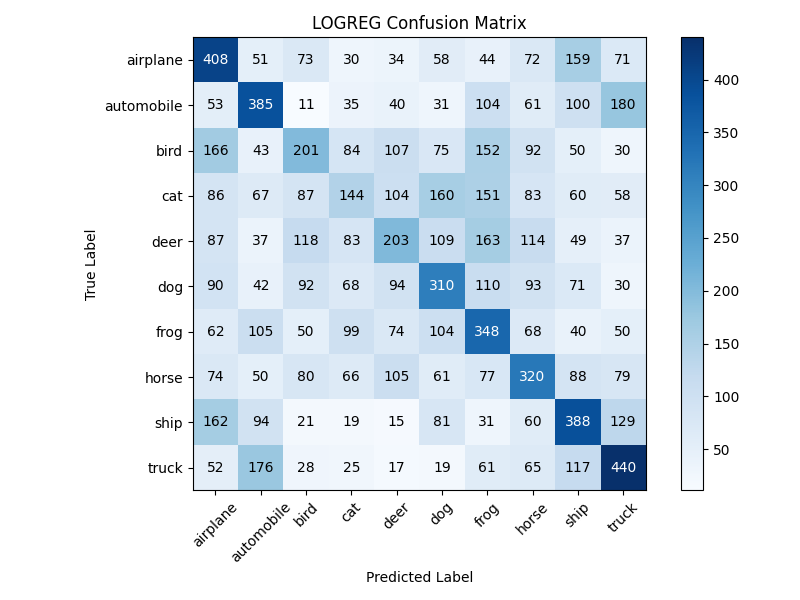
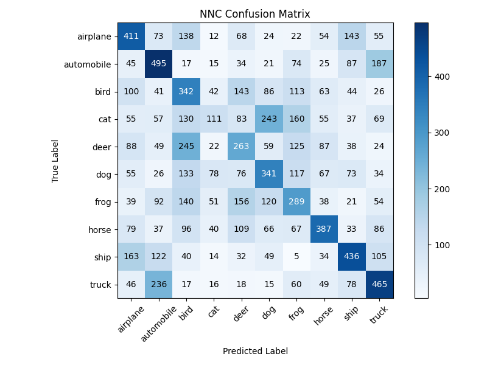

# Assignment 2 - Classification benchmarks with Logistic Regression and Neural Networks

---
# Introduction and contents
This repo contains scripts for performing image classifcation on a cifar10 dataset using both a neural network classifier and a log reg classifer.

This repository contains a few files:

Out: Folder used for outputs / results, 

src: folder containing  scripts for performing image classifcation using the Cifar10 dataset with logistic regression and a neural network classifer.

run.sh setup.sh and setupandrun.sh : bash scripts that setup or run the scripts desired.

assignment_description.md:the discription given when originally recieving the assignment.

## Data
The cifar10 dataset (https://www.cs.toronto.edu/~kriz/cifar.html) consists of 60K images seperated into 10 classes.

## Models
The src folder contains two Python scripts logreg_classifier.py and NNN_classifier.py which both import, preprocess and performs classification on the data.

The script "lr_classifier.py" employs multinomial logistic regression for image classification, while the "nn_classifier.py" script utilizes a multi-layer Perceptron classifier. 

## script functions
The Python scripts follow a structured pipeline with the following steps:

1. Importing the data required for the classification task and proprocessing it.
2. loads the cifar-10 dataset
3. Fitting the loaded model to the training data
4. Using the trained model to predict the labels for the test data.
5. Generating a classification report that includes evaluation metrics accuracy, precision, recall, and F1-score for the predictions. This report is both printed and saved in the out folder.
6. a confusion matrix is also generated in the out folder for both of the models.

### how to replicate
### copy the repository 
git clone https://github.com/AU-CDS/assignment2-image-classification-Olihaha

make sure to be in correct directory

(cd assignment2)

### run the files
Either run the setup.sh file followed by the run.sh file 

or run the runandsetup.sh file. doing either will result in the following: 

1. Creating a virtual environment specifically for the project
2. Activating the venv
3. Installing the required packages from the requiremnets.txt file
4. Running both the src files. "(logreg_classifier.py and NNN_classifier.py)"
5. Deactivating the venv

## Results
### Classfication report
Upon comparing the classification reports, it appears that the NN-classifier demonstrates slightly better performance with an accuracy of 35%, while the LR-classifier lags behind with an accuracy of 31%. However, it is worth noting that both classifiers' performances are somewhat disappointing especially considering that the cifar10 dataset has 10 different labels meaning that at random we would end up with 10% accuracy. 
interesstingly enough both of our classifiers are terrible at predicting cats, birds, deers and frogs, lets find out why.

### Log_reg results
              precision    recall  f1-score   support
    airplane       0.36      0.35      0.35      1000
    automobile       0.36      0.39      0.38      1000
        bird       0.24      0.32      0.27      1000
         cat       0.23      0.16      0.19      1000
        deer       0.26      0.15      0.19      1000
         dog       0.31      0.30      0.31      1000
        frog       0.29      0.31      0.30      1000
       horse       0.32      0.31      0.32      1000
        ship       0.35      0.39      0.37      1000
       truck       0.37      0.46      0.41      1000
    accuracy                           0.31     10000
    macro avg       0.31      0.31      0.31     10000
    weighted avg       0.31      0.31      0.31     10000

### NN RESULT 
              precision    recall  f1-score   support

    airplane       0.38      0.41      0.40      1000
    automobile       0.40      0.49      0.44      1000
        bird       0.26      0.34      0.30      1000
         cat       0.28      0.11      0.16      1000
        deer       0.27      0.26      0.27      1000
         dog       0.33      0.34      0.34      1000
        frog       0.28      0.29      0.28      1000
       horse       0.45      0.39      0.42      1000
        ship       0.44      0.44      0.44      1000
       truck       0.42      0.47      0.44      1000

    accuracy                           0.35     10000
    macro avg       0.35      0.35      0.35     10000
    weighted avg       0.35      0.35      0.35     10000

### confusion matrixes

When examining the confusion matrixes they both appear with similar traits, and its difficult to any significant outliers differneces between the two

Interesstingly enough both moddels struggle heavily when it comes to predicting animals. Our model is great at predicting airplanes and pretty good at predicting automobiles, especially considering how i would imagine it being difficult to tell apart trucks and automobiles.

some funny outliers to notice are 

Cats and dogs being mixed up often, which is not really that surprising given the somewhat similar appearance.

Birds and deers getting mixed up often: i wouldnt  expect these to animals to have similar apperances but it would seem they apparently do.

## evaluation
unlike the former assignement, our machine this time doesnt suffer from the same issues brought forward, but it is still not very accurate. In the next assignement(3) we will process a model on a much larger and more detailed dataset, this will naturally produce a better result, but at the price of time and convenience. Running our two former scrips is a matter of minutes, the next assignment is a matter of hours. 